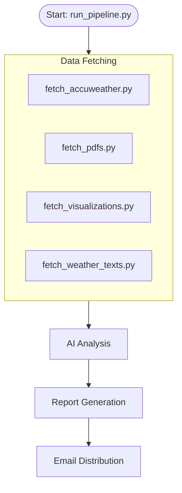

# Project AWRA - Project Overview

**Automated Weather Report Analytics (AWRA)**

## 📖 Introduction
Project AWRA is an automated pipeline designed to streamline the daily weather reporting process. It systematically collects weather data from PAGASA and AccuWeather, analyzes it using AI, and generates professional PDF reports.

## 🚀 Key Features
- **Multi-Source Data Collection**: Scrapes text forecasts, downloadable PDFs, and satellite images.
- **AI-Powered Summarization**: Uses GPT-5.2 to synthesize data into an "Operational Weather Summary".
- **Smart LPA Detection**: Specifically engineered to detect "Low Pressure Area" warnings.
- **Automated PDF Generation**: Renders a branded, high-quality PDF report.
- **Flexible Delivery**: Interactive Email Sender supports "Test" and "Live" modes.

## 🛠️ Technology Stack
- **Language**: Python 3.x
- **Scraping**: Playwright
- **AI**: OpenAI API
- **PDF**: ReportLab, pdfplumber

## 📂 Project Structure
```text
Project AWRA v2/
├── .venv/                  # Virtual Environment
├── config/
│   └── sources.json        # Configuration
├── data/
│   └── output-YYYY-MM-DD/  # Daily output
├── documentation/          # Docs
├── fetchers/               # Scripts
├── run_pipeline.py         # Main Orchestrator
└── ...
```

# Quick Start Guide

## 📥 Installation
1. **Activate Venv**:
   ```powershell
   cd "F:\for PORTFOLIO\Project AWRA v2"
   .\.venv\Scripts\activate
   ```
2. **Install Deps**:
   ```powershell
   pip install -r requirements.txt
   playwright install chromium
   ```

## ▶️ Running
1. Run: `python run_pipeline.py`
2. Wait for completion (~2 mins).
3. Select **TEST** or **LIVE** on the popup.

# Workflow Guide

## 🔄 Visual Workflow



## 📝 Process Steps
1. **Orchestration**: `run_pipeline.py` triggers all fetchers concurrently.
2. **Fetching**:
    - `fetch_weather_texts.py` scrapes PAGASA forecast text (including LPA warnings).
    - `fetch_pdfs.py` downloads the 5-Day Outlook PDF.
    - `fetch_accuweather.py` scrapes AccuWeather 10-day forecast.
3. **Summarization**: `generate_summary.py` uses OpenAI to summarize the data into `summary.json`.
4. **Rendering**: `render_report.py` creates the PDF report.
5. **Distribution**: `send_email.py` asks for mode (TEST/LIVE) and sends the email.
