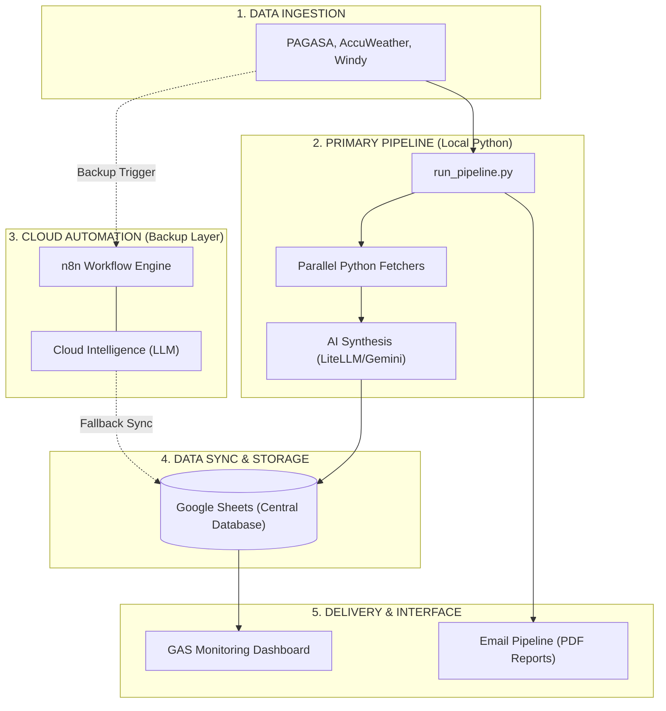

<h1 align="center">Project AWRA</h1>

<p align="center">
  Automated Weather Reporting Assistant harnessing n8n for orchestration, Python for high-fidelity rendering, and Google Apps Script for live monitoring.
</p>

<p align="center">
  
  
  
  
</p>

---

*   If you find this weather automation tool useful for your meteorological workflows, please consider giving it a star!

**Project AWRA** (Automated Weather Reporting Assistant) is a robust, self-hosted weather intelligence pipeline. It systematically collects data from multiple sources (PAGASA, AccuWeather, Windy), processes it using the latest Generative AI models for professional summaries, and provides a polished, interactive Dashboard for real-time monitoring and PDF export.

The project uses a **Hybrid Automation Architecture**, separating the cloud-based orchestration (n8n Intelligence) from the high-performance local processing (Python Pipeline), secured via Google Workspace integration.

---

## System Architecture

The Project AWRA pipeline utilizes a **Python-First** approach for high-fidelity local processing, with an **n8n Cloud-Native** workflow serving as a robust secondary automation layer.


```mermaid
graph TD
    %% Data Acquisition
    subgraph "1. DATA INGESTION"
        Sources["PAGASA, AccuWeather, Windy"]
    end

    %% Main Pipeline
    subgraph "2. PRIMARY PIPELINE (Local Python)"
        PythonPipe["run_pipeline.py"]
        Fetchers["Parallel Python Fetchers"]
        LocalAI["AI Synthesis (LiteLLM/Gemini)"]
        
        PythonPipe --> Fetchers
        Fetchers --> LocalAI
    end

    %% Cloud Backup
    subgraph "3. CLOUD AUTOMATION (Backup Layer)"
        N8N["n8n Workflow Engine"]
        CloudAI["Cloud Intelligence (LLM)"]
        
        N8N --- CloudAI
    end

    %% Synchronization
    subgraph "4. DATA SYNC & STORAGE"
        Sheets[("Google Sheets (Central Database)")]
    end

    %% Consumer Layers
    subgraph "5. DELIVERY & INTERFACE"
        GAS["GAS Monitoring Dashboard"]
        Email["Email Pipeline (PDF Reports)"]
    end

    %% Flow Connections
    Sources --> PythonPipe
    Sources -.->|Backup Trigger| N8N
    LocalAI --> Sheets
    CloudAI -.->|Fallback Sync| Sheets
    Sheets --> GAS
    PythonPipe --> Email
```

**Key Components:**
- **Primary Python Pipeline**: A multi-threaded orchestrator that handles high-speed parallel fetching and local PDF rendering.
- **AI Intelligence**: Dual-layer synthesis (supporting Gemini and OpenAI) to process technical bulletins into human-readable alerts.
- **Backup n8n Layer**: A cloud-based workflow designed to provide redundancy and remote triggering capabilities.
- **Reporting Engine**: Generates specialized PDF reports featuring trend visualizations and AI-driven operational recommendations.

---

## Output Gallery

Explore the artifacts generated by the AWRA pipeline:

### Automated Weather Report (PDF)
A professionally branded, AI-summarized report generated daily for executive distribution.
[📄 View Sample PDF Report](assets/images/weather_report_sample.pdf)

### Web App Dashboard
Real-time monitoring interface with glassmorphic UI and live satellite integration.


---

## User Interface

The application features a modern, responsive weather-focused interface.

### Weather Intelligence Dashboard
Monitor real-time satellite feeds, heat index tracking, and localized 10-day forecasts.


### Automated PDF Reporting & Analysis
Review AI-generated summaries and trend visualizations in executive-ready PDF format.


---

## Features

*   **Self-Hosted & Private**: Designed to run on local infrastructure with cloud-synced monitoring.
*   **Modern UI**: Beautiful, responsive dashboard built with TailwindCSS and Google Apps Script.
*   **Intelligent Extraction**: Uses LLMs to parse complex PAGASA bulletins and generate safety advisories.
*   **Multi-Source Sync**: Real-time integration of AccuWeather, Windy, and official government data.
*   **Automated Delivery**: Scheduled PDF generation and email dispatch for daily weather briefings.
*   **Operational Readiness**: AI-driven "Ops Recos" providing actionable guidance based on weather severity.

---

## Requirements

*   Python 3.10+
*   n8n Instance (Self-hosted or Cloud)
*   Google Cloud Service Account (for Sheets/GAS API)
*   OpenAI or Gemini API Key

---

## Installation

Clone the repository:

```bash
git clone https://github.com/huwanbisente/Project-AWRA.git
cd Project-AWRA
```

Install dependencies:

```bash
pip install -r requirements.txt
```

---

## Configuration

1.  **Environment Variables**: Create a `.env` file in the root directory:
    ```ini
    OPENAI_API_KEY=your_key
    ACCUWEATHER_API_KEY=your_key
    SPREADSHEET_ID=your_id
    ```

2.  **Start Local Pipeline**:
    ```bash
    python run_pipeline.py
    ```

3.  **Deploy Dashboard**:
    Copy `webapp/Code.gs` and `webapp/index_GAS_v2.html` to a new Google Apps Script project and deploy as a Web App.

---

## Project Structure

```text
├── run_pipeline.py         # Main Automation Orchestrator
├── core/                   # PDF Rendering and Processing Logic
├── fetchers/               # Parallel Data Retrieval Scripts
├── n8n/                    # Workflow Definitions and JS Parsers
├── webapp/                 # Dashboard Code and HTML Templates
├── assets/                 # Brand Assets and Documentation Images
└── documentation/          # Detailed Architecture and Setup Guides
```
