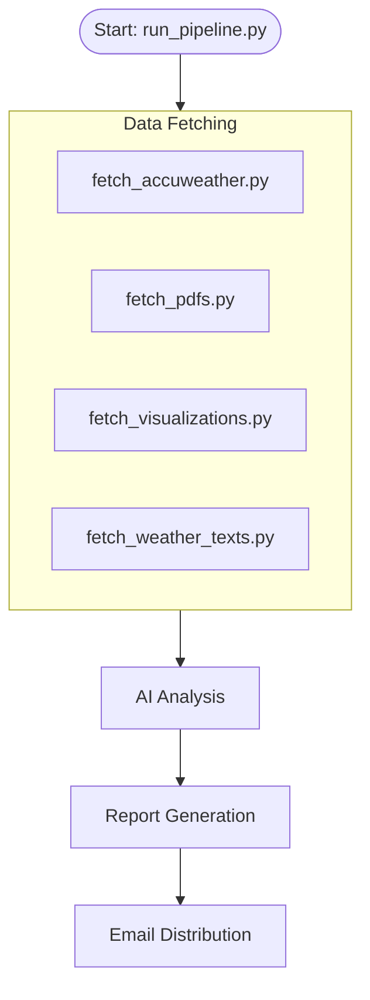

# Workflow Guide

## 🔄 Visual Workflow

## 📝 Process Steps
1. **Orchestration**: `run_pipeline.py` triggers all fetchers concurrently.
2. **Fetching**:
    - `fetch_weather_texts.py` scrapes PAGASA forecast text (including LPA warnings).
    - `fetch_pdfs.py` downloads the 5-Day Outlook PDF.
    - `fetch_accuweather.py` scrapes AccuWeather 10-day forecast.
3. **Summarization**: `generate_summary.py` uses OpenAI to summarize the data into `summary.json`.
4. **Rendering**: `render_report.py` creates the PDF report.
5. **Distribution**: `send_email.py` asks for mode (TEST/LIVE) and sends the email.
